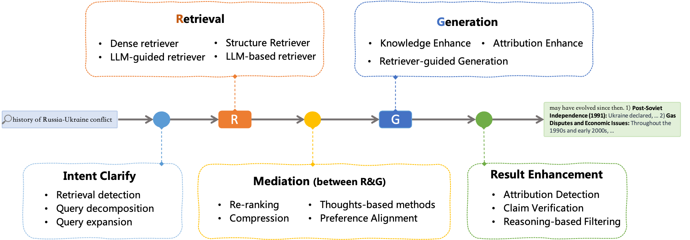

# awesome-papers-for-rag

A curated list of resources dedicated to retrieval-augmented generation (RAG).

The retrieval-augmented generation (RAG) is to combine the merits of retrieval system and llm to generation high-quality answers for users.

<div align="center">
    
    <br><br>
    <p><b>The Framework for RAG System</b></p>
</div>


Typically, the rag system consists of a set of modules, where each task are described as follows:

|         **Components**         |     **Input**     |  **Output**  | **Tasks**         | 
| :---------------------------------: | :----------------------: | :----------------: |:----------------: |
|  [Intent Clarify](./rewriter.md)  |         question         |   search queries   | <sub>Query performance prediction, Query (intent) classification, Query expasion, et al. </sub>| 
|   [Retrieval](./ranker.md)   |     question/queries     | documents/passages | <sub>Ad-hoc retrieval, Document retrieval, Passage retrieval, et al.</sub>| 
| [Mediation](./mediation.md) |   questions+documents   |      contexts      | <sub>Re-ranking, Context compression, post-retrieval, et al.</sub> | 
|  [Generation](./generator.md)  |    question+contexts    |       answer       | <sub>Question answering, summarization, et al.</sub> | 
|  [Result Enhancement](./validator.md)  | question+answer+contexts |       answer       | <sub>Claim verification, Attribution, et al.</sub>  | 
|  [Evaluation](./evaluation.md)  | question+answer+contexts |      scores       | <sub>accuracy, faithfulness, et al.</sub>  | 

### Healthcheck

```python
pip3 install -r requirements.txt
python3 healthcheck.py
```

### Surveys for RAG

* The *Organization* column only record the organization of the first author.

| **Date** |                                                                        **Title**                                                                        |          **Organization**          |                                                                   **Code**                                                                   |
| :------------: | :-----------------------------------------------------------------------------------------------------------------------------------------------------------: | :---------------------------------------: | :------------------------------------------------------------------------------------------------------------------------------------------------: |
|   2024/09/16  |                              [Trustworthiness in Retrieval-Augmented Generation Systems: A Survey](https://arxiv.org/abs/2409.10102)                              |             Tsinghua University             |           [Code](https://github.com/smallporridge/TrustworthyRAG)`</br>`           |
|   2024/09/10   |                              [Graph Retrieval-Augmented Generation: A Survey](https://arxiv.org/abs/2408.08921)                              |             Peking University             |           [Code](https://github.com/pengboci/GraphRAG-Survey)`</br>`           |
|   2024/02/29   |                              [Retrieval-Augmented Generation for AI-Generated Content: A Survey](https://arxiv.org/abs/2402.19473)                              |             Peking University             |           [Code](https://github.com/hymie122/RAG-Survey)`</br>`           |
|   2024/01/03   |                              [Retrieval-Augmented Generation for Large Language Models: A Survey](https://arxiv.org/abs/2312.10997)                              |             Tongji University             |       [Code](https://github.com/Tongji-KGLLM/RAG-Survey)`</br>`       |
|   2024/01/03   |                    [A Comprehensive Survey of Hallucination Mitigation Techniques in Large Language Models](https://arxiv.org/abs/2401.01313)                    |     Islamic University of Technology     |                                                                         No                                                                         |
|   2023/12/07   | [Trends in Integration of Knowledge and Large Language Models: A Survey and Taxonomy of Methods, Benchmarks, and Applications](https://arxiv.org/abs/2311.05876) |      Harbin Institute of Technology      |                                                                         No                                                                         |
|   2023/09/19   |                            [The Rise and Potential of Large Language Model Based Agents: A Survey](https://arxiv.org/abs/2309.07864)                            |              Fudan NLP Group              | [Code](https://github.com/WooooDyy/LLM-Agent-Paper-List)`</br>` |
|   2023/08/14   |                                  [Large Language Models for Information Retrieval: A Survey](https://arxiv.org/abs/2308.07107)                                  |             Renmin University             |       [Code](https://github.com/RUC-NLPIR/LLM4IR-Survey)`</br>`       |
|   2022/02/02   |                                       [A Survey on Retrieval-Augmented Text Generation](https://arxiv.org/abs/2202.01110)                                       | Nara Institute of Science and Techonology |                                                                         No                                                                         |

### Systems for RAG

* The *Organization* column only record the organization of the first author.

| **Date** | **Title** | **Organization**  |  **Code**  |
| :-----------: | :-------------: | :----------------------: |  :----------------------: 
|2024/11/07|[LightRAG: Simple and Fast Retrieval-Augmented Generation](https://arxiv.org/abs/2410.05779)|BUPT|[Code](https://github.com/HKUDS/LightRAG)<br>|
|2024/10/25|[StructRAG: Boosting Knowledge Intensive Reasoning of LLMs via Inference-time Hybrid Information Structurization](https://arxiv.org/abs/2410.08815)|ISCAS|[Code](https://github.com/Li-Z-Q/StructRAG)<br>|
|2024/08/21|[RAGLAB: A Modular and Research-Oriented Unified Framework for Retrieval-Augmented Generation](https://arxiv.org/abs/2408.11381)|Nanjing University|[Code](https://github.com/fate-ubw/RAGLab)<br>|
|2024/07/11|[Speculative RAG: Enhancing Retrieval Augmented Generation through Drafting](https://arxiv.org/abs/2407.08223)          |     University of California, San Diego     |        No        |
|2024/06/19|[InstructRAG: Instructing Retrieval-Augmented Generation via Self-Synthesized Rationales](https://arxiv.org/abs/2406.13629)|University of Virginia|[Code](https://github.com/weizhepei/InstructRAG)<br>|
|2024/05/22|[FlashRAG: A Modular Toolkit for Efficient Retrieval-Augmented Generation Research](https://arxiv.org/pdf/2405.13576)|Renmin University of China|[Code](https://github.com/RUC-NLPIR/FlashRAG)<br>|
|2024/04/24|[From Local to Global: A Graph RAG Approach to Query-Focused Summarization](https://arxiv.org/abs/2404.16130)               | Microsoft |     [Code](https://www.microsoft.com/en-us/research/project/graphrag/)     |
|2023/11/22|[FreshLLMs: Refreshing Large Language Models with Search Engine Augmentation](https://arxiv.org/abs/2310.03214)|Google|[Code](https://github.com/freshllms/freshqa)<br>|
|2023/11/08|[PDFTriage: Question Answering over Long, Structured Documents](https://arxiv.org/abs/2309.08872)|Stanford|[Code](https://github.com/HAMNET-AI/PDFTriage)<br>|
|2023/10/27|[WikiChat: Stopping the Hallucination of Large Language Model Chatbots by Few-Shot Grounding on Wikipedia](https://arxiv.org/pdf/2305.14292v2.pdf)|Stanford|[Code](https://github.com/stanford-oval/WikiChat)<br>|
|2023/10/27|[LeanDojo: Theorem Proving with Retrieval-Augmented Language Models](https://arxiv.org/abs/2306.15626)|Caltech|[Code](https://github.com/lean-dojo/LeanDojo)<br>|
|2023/06/13|[WebGLM: Towards An Efficient Web-Enhanced Question Answering System with Human Preferences](https://arxiv.org/abs/2306.07906)|Tsinghua University|[Code](https://github.com/THUDM/WebGLM)<br>|
|2023/05/23|[WebCPM: Interactive Web Search for Chinese Long-form Question Answering](https://arxiv.org/abs/2305.06849)|Tsinghua University|[Code](https://github.com/thunlp/WebCPM)<br>|
|2022/06/01|[WebGPT: Browser-assisted question-answering with human feedback](https://arxiv.org/abs/2112.09332)|Open AI|No|


